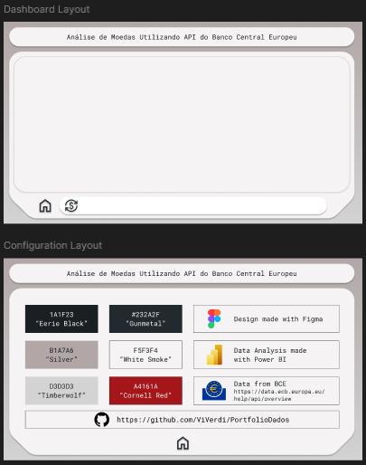
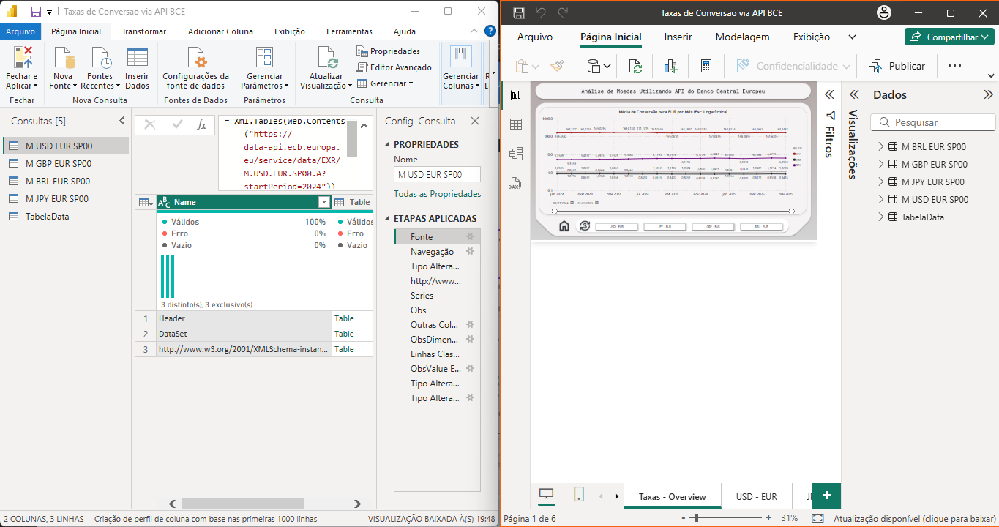

# Sobre o projeto

Design realizado com Figma, e ETL construído diretamente no Power BI de forma simplificada, utlizando a API do Banco Central Europeu para atualizar os dados.  
Habilidades desenvolvidas: APIs / Figma / PowerBI

## API

Utilizada a API do BCE, documentação disponível em:
[Documentação API BCE](https://data.ecb.europa.eu/help/api/overview)  
https://data.ecb.europa.eu/help/api/overview

## FIGMA

Utilizado o FIGMA para execução do Layout-Base  

## Power BI  

Utilizado o Power BI para comunicação e tratamento dos dados da API.  
Poderia ser utilizada a conexão ODBC, porém a fim de simplificação da consulta a fonte foi consultada diretamente via Web.Contents  

